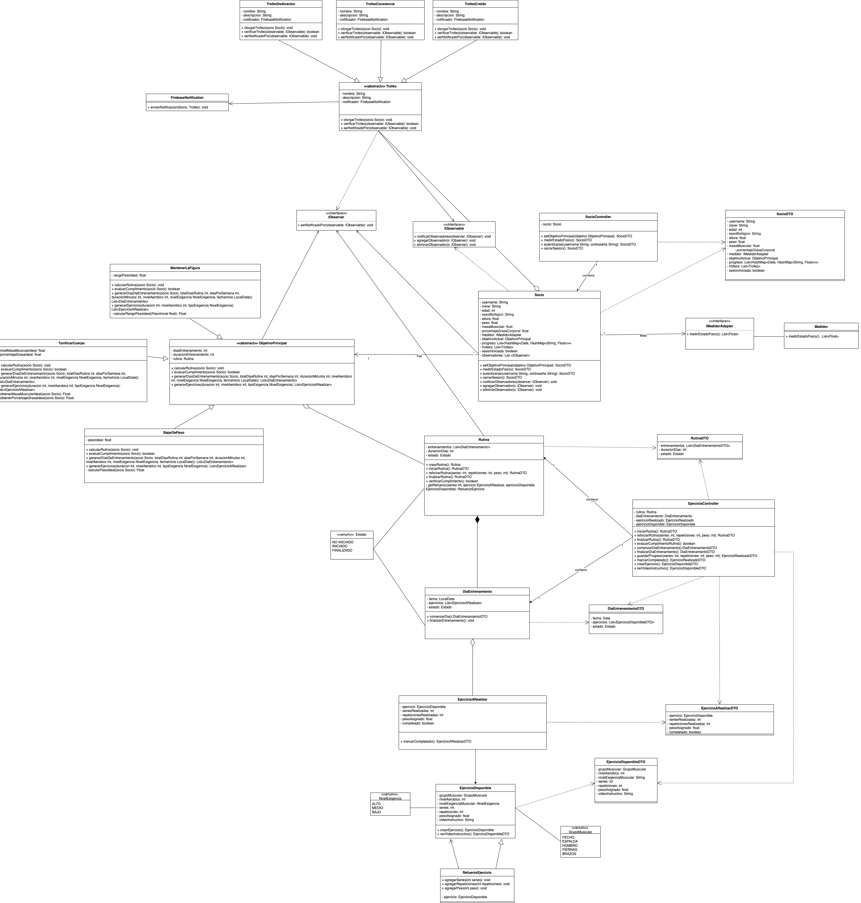

# Coleman Fitness Center - Mandatory Project

This project, developed as a mandatory project for the **Software Development Process** course at the **Universidad Argentina de la Empresa (UADE)**, aims to model a personalized workout tracking system for a gym folowing a series of design patterns. The system, named GymPal, is designed to provide users with a tailored and motivating experience, helping them achieve their fitness goals.

### Development Team

* Franco Baltasar Massi
* Juan Martín Garateche

### Submission Date

* November 14, 2024

### Project Objective

To develop a personalized workout tracking system enabling users to:

* **Set goals:** Lose weight, build muscle, or maintain fitness.
* **Generate customized routines:** Based on the user's goals and physical condition.
* **Track progress:** By recording exercises and measurements.
* **Receive motivation:** Through a trophy system and notifications.

### Class Diagram

### Design Patterns Used

* **Decorator:** To enhance exercises in a user's routine.
* **Strategy:** To encapsulate different objectives a client may have.
* **Observer:** To notify users when they achieve their goals.
* **Adapter:** For users to integrate with external measurement systems.

### Technologies Used

* **Programming language:** Java
* **Tools:** IntelliJ IDEA, Git, Lombok

### Core Functionalities

* **User registration:** Allows users to create an account and set their workout goals.
* **Routine generation:** Creates personalized routines based on the user's goals and physical condition.
* **Progress tracking:** Enables users to record their workouts and view their progress.
* **Trophy system:** Rewards users for achieving their goals.
* **Notifications:** Sends notifications to users via email.

### Contributions

This project was developed for the **Software Development Process** course as an academic document for the Computer Science program at UADE. Contributions to this repository are not open as it is an academic project. However, downloading and exploring the repository for educational purposes is permitted.

### License

This project is licensed for academic and non-commercial use only. Redistribution and use in source and binary forms, with or without modification, are permitted for educational purposes. Commercial use, distribution, or sublicensing is prohibited without explicit permission.

### Acknowledgments

We would like to thank **UADE** and the professor, **Matias Damian Stricagnoli**, for their guidance and support during the development of this project.

---

# Coleman Fitness Center - Trabajo Práctico Obligatorio 

Este proyecto, desarrollado como parte del Trabajo Práctico Obligatorio para la materia de **Proceso de Desarrollo de Software** en la **Universidad Argentina de la Empresa (UADE)**, tiene como objetivo modelar un sistema de seguimiento de entrenamiento personal para un gimnasio, siguiendo una serie de patrones de diseño. El sistema, denominado GymPal, está diseñado para brindar a los usuarios una experiencia personalizada y motivadora, ayudándolos a alcanzar sus objetivos de fitness.

### Equipo de Desarrollo

* Franco Baltasar Massi
* Juan Martín Garateche

### Fecha de Entrega

* 14 de Noviembre de 2024

### Objetivo del Proyecto

Desarrollar un sistema de seguimiento de entrenamiento personalizado que permita a los usuarios:

* **Establecer objetivos:** Bajar de peso, tonificar o mantener la figura.
* **Generar rutinas personalizadas:** Basadas en el objetivo del usuario y su estado físico.
* **Realizar un seguimiento de su progreso:** A través del registro de ejercicios y mediciones.
* **Recibir motivación:** A través de un sistema de trofeos y notificaciones.

### Diagrama de Clases

### Patrones de Diseño Utilizados

* **Decorator:** Para reforzar los ejercicios de la rutina de un usuario.
* **Strategy:** Para encapsular diferentes ojetivos que pueda llegar a tener el cliente.
* **Observer:** Para notificar a los usuarios cuando alcanzan sus objetivos.
* **Adapter:** Para que el usuario pueda medirse con un sistema externo.

### Tecnologías Utilizadas

* **Lenguaje de programación:** Java
* **Herramientas:** IntelliJ IDEA, Git, Lombok

### Funcionalidades Principales

* **Registro de usuarios:** Permite a los usuarios crear una cuenta y establecer sus objetivos de entrenamiento.
* **Generación de rutinas:** Crea rutinas personalizadas basadas en los objetivos del usuario y su estado físico.
* **Seguimiento del progreso:** Permite a los usuarios registrar sus entrenamientos y ver su progreso.
* **Sistema de trofeos:** Otorga trofeos a los usuarios por alcanzar sus objetivos.
* **Notificaciones:** Envía notificaciones a los usuarios a través de correo electrónico.
  
### Contribuciones

Este proyecto fue desarrollado para la materia **Proceso de Desarrollo de Software** como un documento académico para el programa de Ingeniería en Informática en UADE. Las contribuciones a este repositorio no están abiertas, ya que se trata de un proyecto académico. Sin embargo, se permite descargar y explorar el repositorio con fines educativos.

### Licencia

Este proyecto está licenciado para uso académico y no comercial únicamente. La redistribución y el uso en formas de fuente y binario, con o sin modificaciones, están permitidos para fines educativos. Se prohíbe el uso comercial, distribución o sublicencia sin permiso explícito.

### Agradecimientos

Agradecemos a **UADE** y al profesor, **Matias Damian Stricagnoli**, por su guía y apoyo durante el desarrollo de este proyecto.
